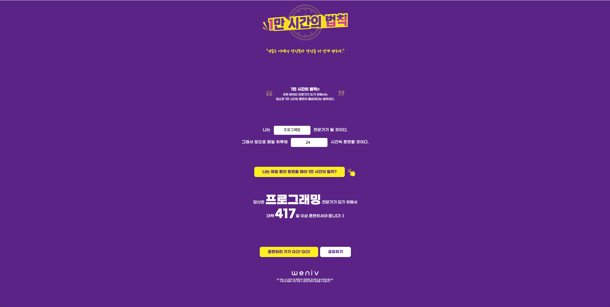

# 1만 시간의 법칙 계산기

## 목차
- [1. 프로젝트 소개](#1-프로젝트-소개)
- [2. 개발 환경](#2-개발-환경)
- [2.2 배포 URL](#22-배포-URL)
- [3. 프로젝트 구조](#프로젝트-구조)
- [4. 개발 일정 (WBS)](#개발-일정-wbs)
- [5. 메인 기능 설명](#메인-기능-설명)
- [6. 에러와 해결 과정](#에러와-해결-과정)
- [7. 개발하며 느낀점](#개발하며-느낀점)

---

## 1. 프로젝트 소개


### 1.1 목표
"1만 시간의 법칙"을 기반으로 사용자가 원하는 분야의 전문가가 되기 위해 필요한 훈련 기간을 계산해주는 웹 애플리케이션입니다. 사용자가 목표 분야와 하루 훈련 시간을 입력하면, 1만 시간을 채우기 위해 필요한 일수를 계산하여 제공합니다.

### 1.2 기능
- 목표 분야 입력 및 하루 훈련 시간 계산
- 1만 시간 달성에 필요한 일수 자동 계산
- 반응형 웹 디자인 (모바일, 태블릿, 데스크톱 대응)
- 응원 모달 팝업
- 결과 공유 기능

### 1.3 팀 구성

| 이름 | 담당 |
|:---:|:---|
|강주현 | 기획 · 프론트엔드 · 배포 |
---

## 2. 개발 환경

### 2.1 개발환경 
### 기술 스택
- **HTML5**: 시맨틱 마크업
- **CSS3**: Flexbox, CSS Variables, 반응형 디자인
- **JavaScript (Vanilla)**: DOM 조작, 이벤트 핸들링
- **Git & GitHub**: 버전 관리

### 웹 표준 및 접근성
- 시맨틱 HTML 구조
- WAI-ARIA 속성 적용 (`aria-live`, `aria-hidden`)
- 스크린 리더 대응 (`.sr-only` 클래스)
- SEO 최적화 (meta 태그, description)

---

## 2.2 배포 URL

```
https://kjh1208.github.io/The-10000-Hours-Rule/
```

---

## 3. 프로젝트 구조

```
10000hours/
├── index.html              # 메인 HTML 파일
├── css/
│   ├── reset.css          # 브라우저 기본 스타일 초기화
│   └── 10000hours.css     # 메인 스타일시트
├── js/
│   └── 10000hours.js      # JavaScript 로직 (현재 HTML 내부로 통합됨)
└── img/
    ├── favicon.ico
    ├── title.png
    ├── clock.png
    ├── quotes.png
    ├── click.png
    ├── licat.png
    └── logo.png
```

---

## 4. 개발 일정 (WBS)

| 단계 | 작업 내용 | 상태 |
|------|----------|------|
| **1주차** | 프로젝트 기획 및 UI/UX 디자인 | 완료 |
| | HTML 구조 작성 (시맨틱 마크업) | 완료 |
| **2주차** | CSS 기본 스타일 작성 | 완료 |
| | 계산기 로직 구현 (JavaScript) | 완료 |
| | 입력 폼 및 결과 표시 기능 | 완료 |
| **3주차** | 버튼 인터랙션 스타일 추가 | 완료 |
| | 응원 모달 구현 (Dialog API) | 완료 |
| | Footer 영역 추가 | 완료 |
| **4주차** | 반응형 디자인 구현 (모바일 대응) | 진행 중 |
| | 접근성 개선 (ARIA, SEO) | 완료 |
| | 코드 리팩토링 및 최적화 | 완료 |
| | 테스트 및 배포 준비 | 진행 중 |

---

## 5. 메인 기능 설명

### 1. 계산기 기능
사용자가 입력한 목표 분야와 하루 훈련 시간을 바탕으로 1만 시간 달성에 필요한 일수를 계산합니다.

```javascript
// 계산 로직 (index.html:139-161)
const totalHours = 10000;
const days = Math.ceil(totalHours / time);
```

**주요 기능**
- 입력 유효성 검사 (필수 입력, 숫자 범위 1-24시간)
- 올림 계산 (`Math.ceil`)을 통한 정확한 일수 산출
- 동적 결과 표시/숨김 처리

### 2. 응원 모달 (Dialog)
"훈련하러 가기 GO! GO!" 버튼 클릭 시 응원 메시지와 캐릭터가 표시되는 모달 팝업

```javascript
// 모달 구현 (index.html:166-172)
goBtn.addEventListener("click", () => dialog.showModal());
```

**특징**
- HTML5 `<dialog>` 요소 사용
- 접근성 향상 (ESC 키로 닫기, 포커스 관리)
- 배경 어두운 효과 (`::backdrop`)

### 3. 반응형 디자인
모바일(480px 이하) 환경에서 최적화된 레이아웃 제공

```css
/* 모바일 미디어 쿼리 (10000hours.css:435-565) */
@media (max-width: 480px) {
  .hero .title img:first-child {
    width: min(320px, 85vw);
  }
  .calculate-button {
    width: min(567px, calc(100% - 72px - 8px));
  }
}
```

**적용 사항**
- 유동적인 레이아웃 (Flexbox, `flex-wrap`)
- 텍스트 크기 조정 (`clamp()`, `vw` 단위)
- 터치 친화적인 버튼 크기 (최소 64px 높이)

---

## 6. 에러와 해결 과정

### 에러 1: 모바일 환경에서 레이아웃이 깨지는 문제
**문제 상황**
- 데스크톱에서는 정상적으로 보이던 UI가 모바일에서:
  - 버튼이 화면을 넘침
  - 이미지와 버튼 간 간격이 어색하게 벌어짐
  - 타이틀 영역이 과도하게 차지됨

**원인 분석**
- 고정 px 단위(width: 566px) 사용
- 버튼과 아이콘이 개별 요소로 분리되어 레이아웃 제어가 어려움

**해결 과정**
- 버튼과 아이콘을 하나의 wrapper로 묶어 관리
- inline-flex, fit-content 활용
- 모바일 전용 미디어쿼리 활용
```html
<!-- html -->
<div class="calculate-wrap">
  <button class="calculate-button">...</button>
  
</div>
```

```css
/* css */
.calculate-wrap {
  display: inline-flex;
  align-items: center;
  gap: 8px;
  width: fit-content;
}
```

**배운 점**
- 관련된 UI 요소는 논리적으로도, 구조적으로도 묶는 것이 중요
- 반응형에서는 고정값보다 유연한 레이아웃 전략이 필요함


### 에러 2: 계산 버튼과 손가락 아이콘 배치 문제
**문제 상황**
- 버튼과 아이콘이 별도 요소로 분리되어 있어 모바일에서 정렬이 깨짐
- 버튼이 화면을 넘어가는 경우 아이콘이 엉뚱한 위치에 배치

**해결 과정**
```html
<!-- wrapper로 감싸서 그룹화 (index.html:67-77) -->
<div class="calculate-wrap">
  <button>...</button>
  
</div>
```

```css
/* 10000hours.css:236-253 */
.calculate-wrap {
  display: inline-flex;
  align-items: center;
  gap: 8px;
  width: fit-content;
}
```

**배운 점**
- 관련된 요소들은 wrapper로 묶어 하나의 단위로 관리
- `inline-flex`와 `fit-content`로 콘텐츠 크기에 맞는 유연한 레이아웃 구현


## 진행 중인 개선 항목 
(현재 피드백은 받았지만, 수정 진행이 완료되지 않은 항목들)

### 1. Meta 정보 보강
- **현재 상태**: description만 존재
- **개선 필요**:
  - `keywords`, `author` 메타 태그 추가
  - Open Graph 태그 추가 (`og:title`, `og:description`, `og:image`)
  - SEO 최적화를 위한 메타 정보 구조 정리

### 2. CSS 구조 분리
- **현재 상태**: 단일 CSS 파일 사용
- **개선 방향**:
  ```
  styles/
  ├── base.css          # reset, typography, CSS variables
  ├── layout.css        # header, section, footer
  └── components.css    # button, input, modal 등
  ```

### 3. CSS 네이밍 규칙 통일
- **현재 문제**: 일관되지 않은 클래스 네이밍
- **개선 방향**:
  - BEM 방식 적용 (`block__element--modifier`)
  - `_` / `-` 사용 기준 명확화
  - 컴포넌트 의미가 드러나는 네이밍

### 4. 변수 네이밍 개선
- **대상**:
  - CSS 변수 (`--color-*` 등)
  - JavaScript 변수
- **원칙**: 역할 기반 의미 있는 네이밍으로 통일

### 5. 시멘틱 마크업 강화
- **현재 문제**: `div` 중심 구조
- **개선 필요**:
  - `<article>`, `<aside>`, `<header>` 등 시멘틱 태그 활용
  - `<section>` 내부 구조 재설계
  - 콘텐츠 성격에 맞는 태그 사용

---
## 다음 단계
각 항목을 우선순위에 따라 순차적으로 진행하며, 완료 시 체크 표시

> [!NOTE]
> 12월 19일 기준 받은 피드백을 작성하였습니다.  
> 추후 계속 수정해나갈 예정입니다.


## 7. 개발하며 느낀점

### 1. 시맨틱 HTML의 중요성
처음에는 `<div>`와 `<span>`만으로 구조를 만들었지만, `<header>`, `<main>`, `<section>` 등 시맨틱 태그로 리팩토링하면서 코드의 의미가 훨씬 명확해졌습니다. 특히 스크린 리더 사용자를 고려한 `<h1>`, `<h2>` 구조 설계가 접근성 측면에서 얼마나 중요한지 깨달았습니다.

### 2. 반응형 디자인의 어려움과 보람
모바일 반응형을 처음 구현하면서 많은 시행착오를 겪었습니다. 특히 `position: absolute`로 배치된 요소들의 모바일 대응이 가장 어려웠습니다. 하지만 `min()`, `clamp()`, `vw` 단위 등 CSS의 현대적인 기능들을 활용하면서 유연한 레이아웃을 만드는 방법을 배웠습니다.

### 3. 접근성(A11y)에 대한 인식 전환
`aria-live`, `aria-hidden`, `.sr-only` 클래스 등을 적용하면서 웹 접근성이 선택이 아닌 필수임을 느꼈습니다. 장식 이미지에 `alt=""` 처리, 의미 없는 요소에 `aria-hidden="true"` 적용 등 작은 디테일이 실제 사용자 경험에 큰 차이를 만든다는 점을 배웠습니다.

### 4. Git 커밋 메시지의 중요성
개발 과정에서 `feat:`, `style:`, `refactor:`, `a11y:` 등의 컨벤션을 사용해 커밋 메시지를 작성했습니다. 나중에 코드 변경 이력을 추적할 때 이러한 규칙이 얼마나 유용한지 실감했고, 협업에서도 필수적인 습관이라는 것을 알게 되었습니다.

### 6. 앞으로의 목표
- **HTML/CSS 숙련도 향상**: 아직 익숙하지 않은 HTML 구현으로 인해 개발 시간이 지연되었습니다. 반복 학습을 통해 구현 속도를 개선하겠습니다.
- **효율적인 개발 프로세스**: 세부 디테일에 집중하느라 전체 진행이 느려진 측면이 있습니다. 앞으로는 큰 틀을 먼저 구현한 후 세부 사항을 다듬는 방식으로 개발 효율성을 높이겠습니다.
---
